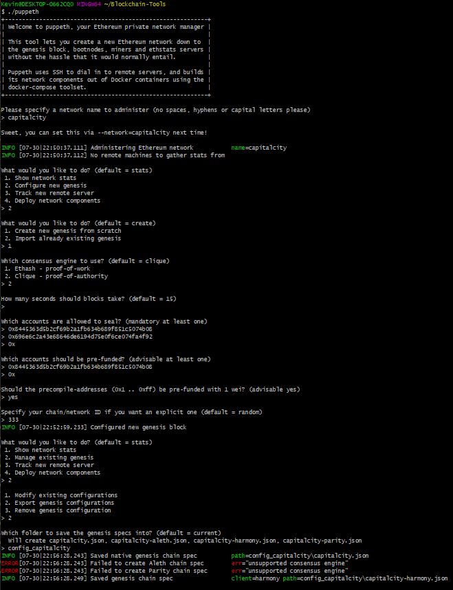
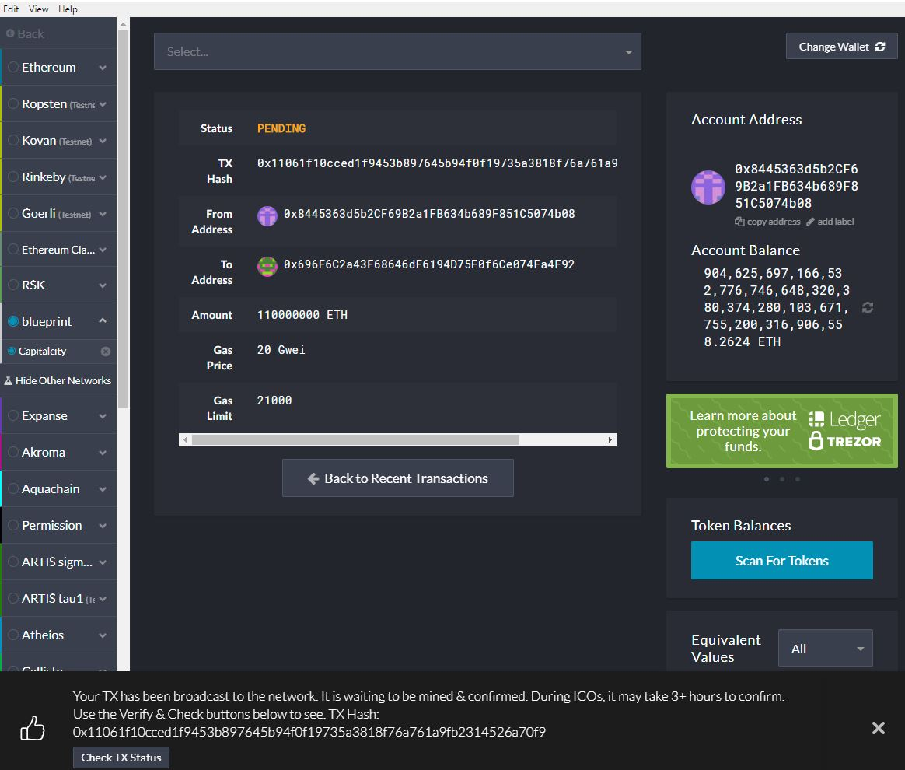
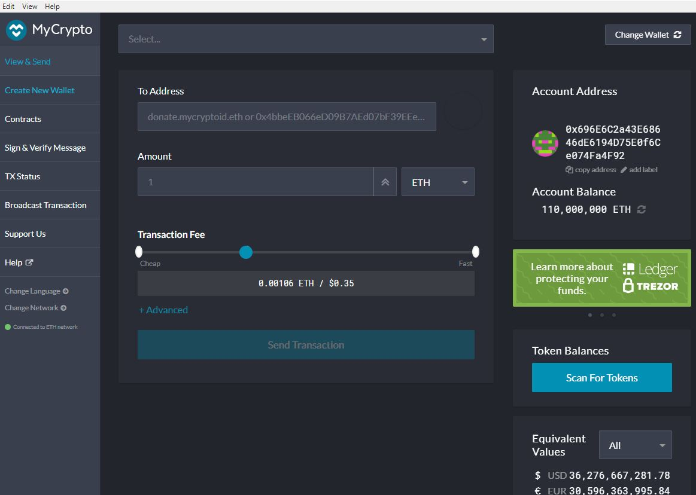

# ZBank Proof of Authority Development Chain
## Setting up the network

The image above provides step by step istructions from:

* Creating node(s) in the network.
	*command: ./geth account new --datadir poa_node1 #repeat for each node
	*notes: record passwords & addresses for each node
	

* Creating a Genesis Block.
	*Using ./puppeth the image below displays the commands used for the following
		*create Genesis Block
		*name network (capitalcity)
		*cloose clique (proof of authority)
		*extract network json file
		
* Initiate each node
Command: ./geth init ./config_capitalcity/capitalcity.json --datadir poa_node1 #repeat for each node

## Running the network

* Run the nodes in the network  
Node1  
Command: ./geth --datadir poa_node1 -unlock '0x8445363d5b2cf69b2a1fb634b689f851c5074b08' --password 'node1.txt' --mine --allow-insecure-unlock --rpc  
flags: 
--datadir: indicates the location of the node  
--unlock: unlocks the address  
--password: indicates password created during node creation. Use bash_profile to store password.  
--mine: starts the node in mining mode  
--password: password for each node. Because of issues with bash_profile a txt file is being used this is unsafe and this will be updated to a safer method of authentication.  
--allow-insecure-unlock :unlock operation is unsafe but using this flag allows access to a node with geth via HTTP protocol  
--rpc: Enable the HTTP-RPC server  

Node2   
Command: ./geth --datadir poa_node2 --unlock "0x696e6c2a43e68646de6194d75e0f6ce074fa4f92" --mine --port 30304 --bootnodes enode://3b8844805e135a44fdf35ab7d274644c97bb518e945d4453a916fa73a79c054e753e3db93397a276b86d399bc6c84c28daa34376efcefc6f36b342eb5a4d1e62@69.200.225.229:30303 --ipcdisable  

Flags: Flags from first node apply additionally:  
--ipcdisable: in order to run multiple nodes the ipc interface is disabled  
--port 30304: uses a different port than the first node  
--bootnodes: helps subsequent nodes locate eachother after starting  

*once nodes have been run they should be able to communicate to eachother.

## Use Mycrypto to connect to local network:
set up custome node:  
Steps: In MyCrypto  
**Add custome node  
**Node Name: Capitalcity  
**Network:Custom  
**Network Name:Capitalcity  
**Currency: ETH  
**Chain ID: 333 (same as the one used during node creation)  
**URL: http://127.0.0.1:8545  

Once connection is stablished in private network the accounts created can be logged into by using the keystore file located in the each specific node directory using the password set up during node creation.  
Once logged in a transaction can ge entered
## Transactions sent from node1 account

## Transactions received from node2 account

