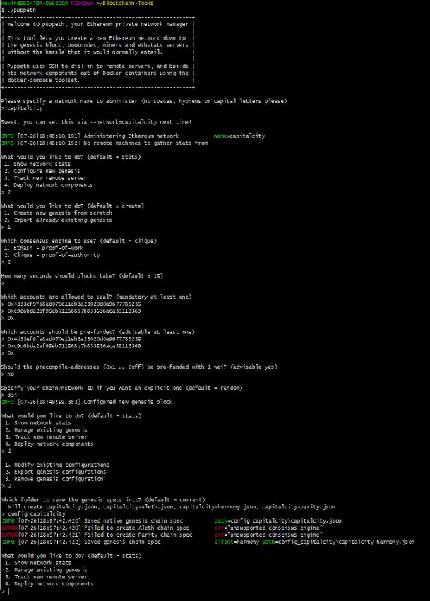

# ZBank Proof of Authority Development Chain
## Setting up the network

The image above provides step by step istructions from:

* Creating node(s) in the network.
	*command: ./geth account new --datadir poa_node1 #repeat for each node
	*notes: record passwords & addresses for each node
	

* Creating a Genesis Block.
	*Using ./puppeth the image below displays the commands used for the following
		*create Genesis Block
		*name network (capitalcity)
		*cloose clique (proof of authority)
		*extract network json file
		

*Initiate each node
Command: ./geth init ./config_capitalcity/capitalcity.json --datadir poa_node1 #repeat for each node

*Run the nodes in the network
Command: ./geth --datadir poa_node1 -unlock '0x8445363d5b2cf69b2a1fb634b689f851c5074b08' --password 'node1.txt' --mine --allow-insecure-unlock --rpc
Notes: 
--datadir: indicates the location of the node
--unlock: unlocks the address
--password: indicates password created during node creation. Use bash_profile to store password.
--mine: starts the node in mining mode

### Create a repository, and instructions for launching the chain

* Create a `README.md` in your project directory and create documentation that explains how to start the network.

* Remember to include any environment setup instructions and dependencies.

* Be sure to include all of the `geth` flags required to get both nodes to mine and explain what they mean.

* Explain the configuration of the network, such as it's blocktime, chain ID, account passwords, ports, etc.

* Explain how to connect MyCrypto to your network and demonstrate (via screenshots and steps) and send a transaction.

* Upload the code, including the `networkname.json` and node folders.

### Remember, *never* share your mainnet private keys! This is a testnet, so coins have no value here!

### Challenge mode

* Create a separate `bootnode` dedicated to connecting peers together

* There will be a new DevOps engineer joining the team, add an additional sealer address to the network on the fly!
